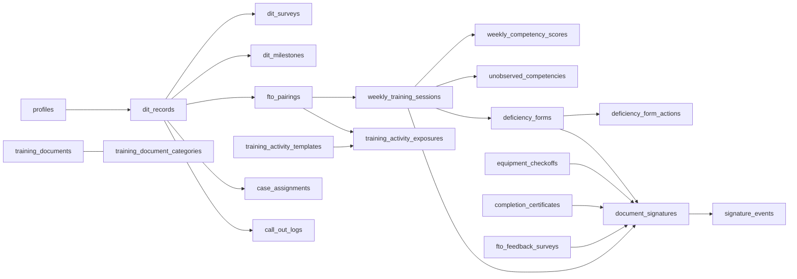

# Training Overhaul Master Plan

Master plan for the full 14-prompt Detective-in-Training (DIT) renovation of the CID Portal training module.

The source prompts live in [CURSOR_PROMPTS_TRAINING_BUILD.md](CURSOR_PROMPTS_TRAINING_BUILD.md). This document is the execution spine: it locks shared foundations upfront so later segments don't have to re-decide them, and it maps every existing training file to an **absorb / retire / keep** decision so drift stays low across the ~18-session build.

> Status: Segment A (Prompts 1-2) is ready to build. Update the **Status** column of [Segment index](#3-segment-index) as each segment ships.

---

## 1. Guiding decisions (locked)

These apply across all 14 prompts. Change them only with a master-plan update.

- **Shell.** Keep the global `NavRail`; add a training-specific sub-nav. Sub-nav items: Dashboard, DIT Files, Schedule, Resources, Settings. The prompt-doc's "top navbar + collapsible left sidebar" is adapted to this.
- **Route group.** Everything stays under `src/app/(dashboard)/training/*`.
- **Eval model.** Keep `weekly_training_sessions` + `weekly_competency_scores` (20-competency weekly flow). **Retire** the legacy `evaluations` table + `TrainingEvaluationModal` at the end of Segment C.
- **Signatures.** Build the core signature system **early** (Segment B foundation), so Weekly Eval / Deficiency / Certificate all consume a mature shared API. iPad UX polish + PDF watermarking ship in Segment C where they're first exercised.
- **Legacy re-export routes** (`/training/{onboarding,dit-records,dit-evaluations,fto-schedule}`) are repurposed as we absorb their concepts; orphans deleted in the Segment C cleanup sweep.
- **Conventions** (set in Segment A, reused everywhere):
  - Server actions for form submit flows. Route handlers under `src/app/api/training/*` for fetches and signer endpoints.
  - Typed action errors: `{ ok: false, code: 'PROFILE_NOT_FOUND' | 'DUPLICATE_BADGE' | ..., message }`.
  - RLS per table: read-scope by role via `src/lib/training/api-auth.ts` helpers; writes via server actions (service role) where elevated.
  - Client UI: shadcn/ui + existing design tokens (`bg-bg-app`, `text-text-primary`, `border-border-subtle`). No new color system.
  - Emails: keep `logTrainingEmailPreview` stub across Segments A-D; wire a real provider in Segment E.

---

## 2. Data model (full target)

### New tables (by segment introduced)

| Segment | New tables / infra |
|---|---|
| A | `dit_surveys` (token, status, `expires_at`, `learning_style jsonb`) |
| B | `document_signatures` (polymorphic: `doc_type`, `doc_id`, `routing_order text[]`, `current_step`, `current_signer_role`, `status`), `signature_events` (per-signer: image base64, timestamp, ip, device, biometric method) |
| C | `case_assignments`, `call_out_logs`, `equipment_checkoffs` |
| D | `training_documents`, `training_document_categories`, `training_resources`; Supabase storage bucket `training-documents` |
| E | `completion_certificates`, `fto_feedback_surveys`, `fto_feedback_responses` |

### Retirements

- **Segment C:** drop `evaluations` + `evaluation_private_notes` after an audit pass. Preserve a read-only SQL view `v_legacy_evaluations` for ~30 days before final drop.

---

## 3. Segment index

| Segment | Prompts | Ship goal | Status |
|---|---|---|---|
| A | 1, 2 | Shell + onboarding (profile + survey stub) | Not started |
| B | 3, 4, 12 (foundation only) | Active DITs grid + DIT file detail + signature core | Not started |
| C | 5, 10, 11 | Weekly Eval + Deficiency + legacy retirement | Not started |
| D | 6, 7, 8, 9 | Activity, Cases/Call-Outs, Schedule grid, Documents/Resources | Not started |
| E | 13, 14 + cleanup | Graduation cert + FTO feedback + delete orphans | Not started |

Prompt 12 is deliberately split: foundation in B, UX polish + PDF in C.

---

## 4. Segment A — Shell + Onboarding (Prompts 1-2)

**Goal:** replace `/training` with a new 5-section landing; build the Onboarding section (Create Profile real, Survey + Meeting Brief as shell).

Files to add:

- `src/app/(dashboard)/training/layout.tsx` - training sub-nav chrome.
- `src/app/(dashboard)/training/page.tsx` - new 5-section landing (Onboarding, Active DIT Files, Documents, Schedule, Resources). Replaces legacy hub re-export.
- `src/app/(dashboard)/training/{dit-files,schedule,resources,settings}/page.tsx` - placeholder pages rendering section-card shells.
- `src/components/training/shell/{training-subnav.tsx,section-card.tsx}`.
- `src/components/training/onboarding/{create-profile-modal.tsx,survey-status-card.tsx,meeting-brief-card.tsx,onboarding-panel.tsx}`.
- `src/app/(dashboard)/training/actions.ts` - add `createDitOnboardingAction(input)`.
- `supabase/migrations/<ts>_dit_surveys.sql` - `dit_surveys` + RLS.
- API stubs:
  - `POST /api/training/dit-records`
  - `GET /api/training/dit-records/[id]/survey-status`
  - `POST /api/training/dit-records/[id]/resend-survey`
- `src/components/dashboard/nav-config.ts` - update training flyout children to new routes.

Deferred from Segment A:

- Public `/survey/[token]` page and full survey question set.
- Real email sending (stays on `logTrainingEmailPreview`).
- Auth-user provisioning from Create Profile; must already exist as a profile (error `PROFILE_NOT_FOUND` otherwise).

Access for Onboarding panel: `admin | supervision_admin | supervision | fto_coordinator` via the existing `trainingFullRead` helper (factored into `src/lib/training/access.ts`).

Detailed sub-plan of record: `.cursor/plans/training_overhaul_prompts_1-2_019f5d5d.plan.md`.

---

## 5. Segment B — DIT roster, detail, signature core (Prompts 3, 4, 12-foundation)

### Prompt 3 - Active DIT Files grid

- Page: `src/app/(dashboard)/training/dit-files/page.tsx` (replaces Segment-A placeholder).
- `src/components/training/files/dit-grid.tsx` - server-side fetch via new `fetchDitFilesOverview()` in `src/lib/training/queries.ts`. Computes status (green/amber/red/gray) from `avg_score`, coaching flag, and `unobserved_competencies` counts.
- `src/components/training/files/dit-tile.tsx` - tile + FTO contact tooltip.

### Prompt 4 - DIT file detail + Overview tab

- Routes: `src/app/(dashboard)/training/dit-files/[id]/page.tsx` and `layout.tsx` (tab chrome).
- Tabs driven by `?tab=overview|weekly|activity|cases|call-outs|notes`.
- Overview tab reads `weekly_competency_scores`, `unobserved_competencies`, `deficiency_forms`, `dit_milestones`.
- `src/lib/training/scoring.ts` - trend arrow, trajectory, on-track-for-graduation helpers (pure functions).

### Prompt 12 foundation (signatures)

- Migration: `document_signatures` + `signature_events` + RLS.
- `src/components/training/signatures/signature-pad.tsx` - HTML5 Canvas client component. Add `signature_pad.js` only if stroke smoothness is insufficient; don't pull it preemptively.
- `src/lib/training/signatures.ts` - `routingRules`, `createSignatureRoute(docType, docId, context)`, `recordSignature(...)`, `advanceRouting(...)`.
- API routes:
  - `POST /api/training/signatures/[id]/sign`
  - `GET /api/training/signatures/queue`
  - `GET /api/training/signatures/[id]/audit-trail`
- `src/components/training/signatures/signature-queue.tsx` - shown on `/training/settings` as "My signature inbox"; surfaced via `NotificationBell` in Segment C.

Explicitly deferred from Segment B to Segment C cap: biometric gate (Face ID / Touch ID / badge PIN prompt) and PDF watermark generation.

---

## 6. Segment C — Weekly Eval, Deficiency, legacy retirement (Prompts 5, 10, 11)

### Prompt 10 - Weekly Evaluation form + signature

- Absorb `src/components/training/weekly-evaluation-form.tsx` into `src/components/training/weekly/eval-form.tsx`. Keep draft/submit endpoints at `/api/training/sessions/[id]/save` and `/submit`, then chain into signature core.
- `src/lib/training/validation.ts` - 20-competency rules (all scored or not-observed; 1/2/5 require <=300 char explanation).

### Prompt 5 - Weekly Eval tab (history)

- Tab inside DIT file detail; reads `weekly_training_sessions` by `dit_record_id`.
- Signature chain display reads `document_signatures` + `signature_events`.
- Thin wrappers at `/api/training/weekly-evals/*` for external doc parity over the existing `sessions/*` API.

### Prompt 11 - Deficiency form + escalation

- Absorb `src/components/training/deficiency-form.tsx` + `deficiency-coordinator-view.tsx` into `src/components/training/deficiency/*`.
- Signature routing (FTO -> Coordinator -> Sgt -> Lt) via Segment B core.
- Escalation uses existing `/api/training/deficiency-forms/[id]/{actions,escalate,schedule-meeting}`.

### Legacy retirement (end of Segment C)

- Delete: `src/components/training/training-view.tsx`, `training-evaluation-modal.tsx`; drop `evaluations` and `evaluation_private_notes` tables (after view-preserve step); keep `training-stamps.tsx` (reusable).
- Delete the legacy hub re-export routes.
- Update `src/lib/admin/mock-data-service.ts` to stop seeding legacy `evaluations`.

---

## 7. Segment D — Activity / Cases / Schedule / Docs (Prompts 6-9)

### Prompt 6 - Activity Sheet tab

- Reads `training_activity_exposures` + `training_activity_templates`.
- `src/lib/training/activity-progress.ts` for exposure math.
- `GET /api/training/dit-records/[id]/activity-exposures` and `/activity-progress`.

### Prompt 7 - Case List + Call-Out tabs

- New tables `case_assignments`, `call_out_logs` (minimal: `dit_record_id`, refs/metadata, timestamps, off-duty flag). Stats computed server-side; off-duty flag surfaces comp-time eligibility.

### Prompt 8 - 10-Week Schedule grid

- Reads `fto_pairings` + `weekly_training_sessions`.
- **Decision to confirm at segment kickoff:** FTO color stored on `profiles.fto_color` (column add) vs hashed from FTO id client-side. Pick one and stick.
- Surfaces at `/training/schedule` (global) and `/training/dit-files/[id]?tab=schedule` (per DIT).

### Prompt 9 - Documents & Resources

- New tables + Supabase storage bucket `training-documents` with RLS and signed-URL downloads.
- `/training/resources` renders both sections. PDF viewer via `react-pdf`; fallback to "Open in new tab" if integration is heavy — pick per-PR.

---

## 8. Segment E — Graduation, feedback, cleanup (Prompts 13-14)

### Prompt 13 - Graduation trigger + certificate

- `completion_certificates` table.
- PDF generation server-side via `pdf-lib` using signature images from `signature_events`.
- Routing: Coordinator -> Lt -> Capt through signature core.
- Auto-trigger hook on week-10 session submit; missing competencies branch to deficiency form instead.

### Prompt 14 - FTO Feedback survey

- `fto_feedback_surveys` + `fto_feedback_responses`.
- DIT-facing form; Coordinator/Sgt dashboard with aggregates; FTO-facing anonymized view (no DIT names or raw comments).

### Final cleanup

- Delete any remaining dead re-export routes, orphaned components, and unused email templates.
- Audit `src/components/dashboard/nav-config.ts` so the Training flyout reflects only the new routes.
- Decide fate of `src/app/(dashboard)/training/dit-dashboard/page.tsx`: absorb into `/training/dit-files/[id]` or keep as DIT-role landing.
- Wire a real email provider for the training notification stub.

---

## 9. Absorb / Retire / Keep (existing training files)

| File | Decision | Segment |
|---|---|---|
| `src/app/(dashboard)/training/training-hub-page.tsx` | Retire | C cleanup |
| `src/app/(dashboard)/training/{onboarding,dit-records,dit-evaluations,fto-schedule}/page.tsx` | Retire (routes repurposed) | C cleanup |
| `src/app/(dashboard)/training/dit-dashboard/page.tsx` | Keep or absorb | E (decide) |
| `src/app/(dashboard)/training/actions.ts` | Absorb (extend; rename some exports) | A-E |
| `src/components/training/training-view.tsx` | Retire | C cleanup |
| `src/components/training/training-enroll-modals.tsx` | Retire (replaced by create-profile-modal) | A |
| `src/components/training/training-evaluation-modal.tsx` | Retire (legacy evals going away) | C cleanup |
| `src/components/training/training-dit-drawer.tsx` | Retire (DIT file detail page replaces) | B |
| `src/components/training/training-pairing-drawer.tsx` | Absorb into pairing edit page | D |
| `src/components/training/weekly-evaluation-form.tsx` | Absorb -> `weekly/eval-form.tsx` | C |
| `src/components/training/deficiency-form.tsx` | Absorb -> `deficiency/form.tsx` | C |
| `src/components/training/deficiency-coordinator-view.tsx` | Absorb -> `deficiency/coordinator-inbox.tsx` | C |
| `src/components/training/activity-logger.tsx` | Absorb -> `activity/logger.tsx` | D |
| `src/components/training/activity-list-summary.tsx` | Absorb -> `activity/list-summary.tsx` | D |
| `src/components/training/dit-dashboard-view.tsx` | Absorb into DIT file detail tabs | B/D |
| `src/components/training/training-stamps.tsx` | Keep (rename to `shared/stamps.tsx`) | A |
| `src/lib/training/queries.ts` | Keep + extend | A-E |
| `src/lib/training/api-auth.ts` | Keep (extend with signer-role checks) | B |
| `src/lib/email/templates/training/*` | Keep; add certificate / graduation / fto-feedback templates | E |
| `src/lib/email/training-notifications.ts` | Keep stub; wire real provider | E |
| `src/types/training.ts` | Keep; extend per segment | A-E |
| `src/app/api/training/sessions/*` | Keep (weekly eval pipeline) | C |
| `src/app/api/training/activities/*`, `activity-templates`, `competency-masters` | Keep | D |
| `src/app/api/training/deficiency-forms/*` | Keep | C |

---

## 10. Segment gates (done-when criteria)

Each segment merges to `main` only when:

- All new migrations applied locally + RLS tested against the 7 roles (`admin`, `supervision_admin`, `supervision`, `fto_coordinator`, `fto`, `detective`, `dit`).
- New routes return non-404 for authorized roles and 403 for unauthorized.
- Lint + typecheck clean.
- No references remain to files marked **Retire (this segment)** in the table above.
- This document is updated with any scope drift discovered during the segment.

---

## 11. Signature routing reference (master)

| Document | Route | Final signer |
|---|---|---|
| Weekly Eval | FTO -> Coordinator -> SGT | SGT |
| Equipment Check-Off | FTO -> Coordinator -> SGT | SGT |
| Deficiency / Remedial | FTO -> Coordinator -> SGT -> LT | LT |
| Completion Certificate | FTO -> Coordinator -> SGT -> LT -> CPT | CPT |
| FTO Feedback Survey | DIT (self) -> Coordinator -> SGT | SGT (review) |

Implemented in `src/lib/training/signatures.ts` (Segment B) as `routingRules[doc_type] -> string[]`; `document_signatures.routing_order` is the per-row snapshot so rule changes don't retroactively alter in-flight documents.
